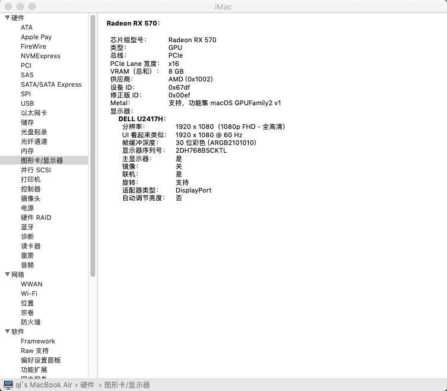
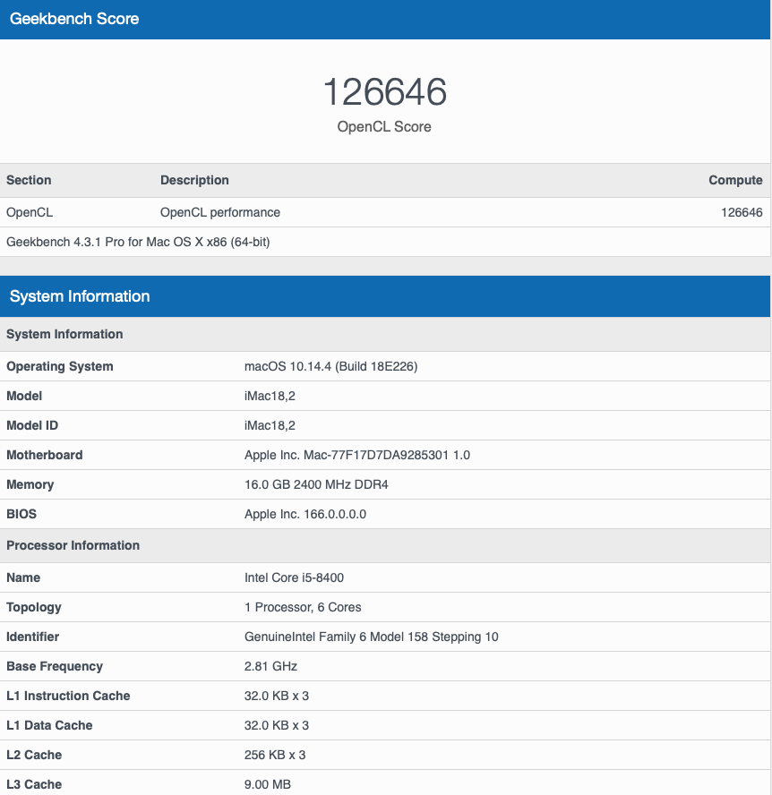

# Hackintosh 黑苹果

## Build Parts

| **....**     | ****      |
| ----------  | --------------------------- |
| **CPU**     | **Intel Core i5 8400**      |
| **Mobo**    | **AsRock z370M Pro4**       |
| **Mem**     | **16G DDR4 2400MHz** |
| **Storage** | **samsung SATA SSD 120G（macos）& 建兴SATA SSD(win10) & 1t HDD**|
| **GPU**     | **AMD RX570 8G**  |
| **OS**     | **WIN10 & MACOS 14.4**  |

## BIOS 设置

BIOS 版本：3.20

Advanced \ Chipset Configuration → Vt-d : Disabled

Advanced \ Super IO Configuration → Serial Port: Disabled

Advanced \ USB Configuration → XHCI Hand-off : Enabled

Advanced \ Chipset Configuration → Share Memory : 128MB

Advanced \ Chipset Configuration → IGPU Multi-Monitor : Enabled

## 音频

为了让音频正常工作，Audio Inject 的值必须为 `1`。

## 接口
使用dp
 
### 单独使用核显的
这里不在赘述可以参考下面文档

[Intel Framebuffer patching using WhateverGreen](https://www.insanelymac.com/forum/topic/334899-intel-framebuffer-patching-using-whatevergreen/)。

[corpnewt/Hackintosh-Guide](https://github.com/corpnewt/Hackintosh-Guide/blob/master/config.plist-per-hardware/coffee-lake.md#properties)。

[Kernel panic in Safari with UHD 630 + RX 570](https://www.tonymacx86.com/threads/kernel-panic-in-safari-with-uhd-630-rx-570.264222/)

# 关于

###  没有一劳永逸的，也没有完美，只有趋近完美，有些配置驱动请根据机型情况删除

usb接口方面，用3.0安装没有遇到问题。沒有遇到过[HouCode](https://github.com/HouCoder/asrock-z370m-pro4-hackintosh)的问题，使用的镜像是[黑果小兵](https://blog.daliansky.net/macOS-Mojave-10.14.4-18E226-official-version-with-Clover-4903-original-image.html),其中的配置完全可以引导配置。查找了不少资料感觉讲的较复杂，本人黑苹果实际安装前后大约花了一个半个小时（所需资源已下载），前期查找资料花了一天。站在前人基础上可以省下大量时间。
[补丁制作](http://bbs.pcbeta.com/viewthread-1795112-1-1.html)

## 兼容情况

- [x] 显卡（DisplayPort 接显示器）
    - [ ] Intel UHD630 核显
    - [x] AMD RX570
- [x] 声卡(Realtek ALC1220)
    - [x] 主板后置
    - [x] 机箱前置
    - [x] DisplayPort 声音输出
- [x] 睡眠/唤醒
- [x] 有线网卡
- [ ] 无线 WiFi
- [ ] 蓝牙
    - [ ] 耳机
    - [ ] Airdrop
    - [ ] Handoff
- [x] 所有 USB 插口

### win10已安装留有一个ESP分区，macos只留有一个分区（不包含ESP等）

### 1.烧录软件[etcher](https://www.balena.io/etcher/) 
u盘格式化——烧录，无需其它

### 2.macos镜像

##### [地址一](https://blog.daliansky.net/)

### 3.F11 引导安装
默认镜像安装，一路前进，不在赘述

### 4.把U盘中efi clover 复制出来
CLOVERX64.efi保持不变，使用[HouCode](https://github.com/HouCoder/asrock-z370m-pro4-hackintosh)(其中CLOVERX64.efi删除,config.public.plist改为config.plist)进行替换
【如果你安装的mac留有ESP分区，分区将有clover引导，其中clover.efi不要删除，可用其配置引导】

### 5.复制clover直接到win10ESP分区

### 6.使用easyuefi引导CLOVERX64.efi

### 7.在macos中使用clover config 进行细节的优化，查缺补漏。

## 这是最后的样子

# 双系统 双硬盘 总结

[记录小米笔记本pro安装黑苹果双系统](https://post.smzdm.com/p/akmrken9/)

[黑Z370M-ITX-AC](https://github.com/youngle316/Z370M-ITX-AC)

[Sierra - GA-H81M-DS2V - i5 4570 - GTX 660 - ALC 887 with iMessage - Facetime](http://bbs.pcbeta.com/viewthread-1725201-1-1.html)

[THINKPAD X220 MACOS HIGH SIERRA 10.13](http://x220.mcdonnelltech.com/)

[Mojave硬件支持列表](https://www.chajian110.com/97.html)

[T420完美安装OS X10.11 El Capitan超详细教程（单/双硬盘双系统) ](https://forum.51nb.com/forum.php?mod=viewthread&tid=1639171&extra=page=1&page=1)

[使用CLOVER模拟EFI引导安装OS X+WIN双系统（GPT单硬盘双硬盘通用）](https://blog.csdn.net/qq_36583249/article/details/86102520)

[双系统的安装WIn10下使用Clover引导安装Mac os High Sierra10.13原版镜像](https://blog.csdn.net/lwpdzq/article/details/79562915)

# date

4/22  绝大部分完美，不影响使用，小问题有时间解决 wifi和蓝牙免驱硬件准备配上

# [软件推荐](https://wangchujiang.com/awesome-mac/index.zh.html)